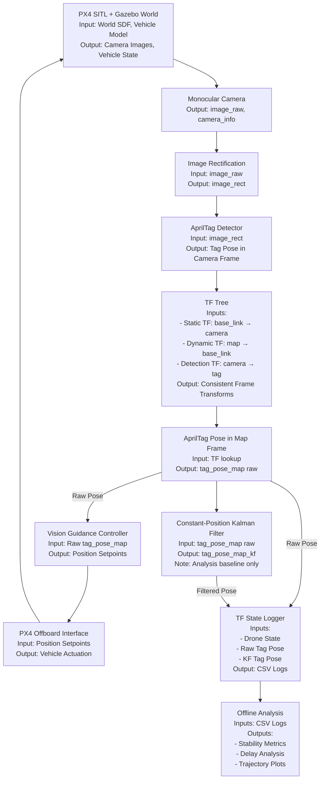

# Vision-Based Precision Landing on a Static AprilTag using PX4 + ROS 2

## Abstract

This repository presents a **vision-based precision landing pipeline for a quadrotor UAV** using a **static AprilTag** in simulation. The system integrates **PX4 SITL**, **Gazebo**, and **ROS 2** to perform autonomous takeoff, search, detection, alignment, and landing.

A **Constant-Position Kalman Filter (KF)** is implemented and evaluated **purely as an analysis baseline**. Through quantitative metrics and delay analysis, we conclude that **raw AprilTag pose estimates outperform KF-filtered poses for a static tag**. Consequently, **the KF is intentionally NOT used for control in the current system**.

The KF work serves as a **foundational baseline for future extension to a moving target**, where a **Constant-Velocity Kalman Filter** will be required.

---

## Simulation Video

The following video shows the full autonomous mission:
takeoff → spiral search → AprilTag detection → alignment → precision landing.

[apriltag_precision_landing.webm](https://github.com/user-attachments/assets/80c82eda-0bc2-4338-995b-e8936a1a7054)

---
## System Overview

### Key Contributions

1. End-to-end PX4–ROS 2 precision landing stack for a static AprilTag  
2. Spiral trajectory-based visual search strategy  
3. TF-consistent multi-frame pose estimation pipeline  
4. Quantitative evaluation of raw vs Kalman-filtered AprilTag poses  
5. Delay analysis demonstrating KF-induced lag  
6. Clear justification for rejecting KF in static-tag control  
7. Design groundwork for future moving-tag landing  

---

### Scope & Assumptions

**In Scope:**
- Static AprilTag detection and pose estimation
- Quantitative comparison of raw vs filtered pose quality
- Complete simulation pipeline with PX4 SITL
- Performance metrics and delay analysis

**Out of Scope:**
- Moving target tracking
- Real-world sensor noise modeling
- Closed-loop visual servoing (current control is open-loop)
- State estimation fusion beyond basic Kalman filtering

**Assumptions:**
- AprilTag is static and rigidly attached to the ground
- Camera intrinsics are perfectly known (simulation)
- Lighting conditions are ideal
- No wind or external disturbances

---

## System Architecture

### High-Level Pipeline



---

## Installation & Setup

### Prerequisites
- Ubuntu 22.04
- ROS 2 Humble
- PX4-Autopilot
- Gazebo (Ignition) Garden
- Python 3.8+

### Gazebo Model adn World Installation (Required)

This project uses **custom Gazebo models and a custom world**, which must be manually installed into the PX4 Gazebo directory.

Copy the following folders from this repository:
- `models/`
- `worlds/`

into you PX4 installation at:

```bash
# Copy models
cp -r models/* ~/PX4-Autopilot/Tools/simulation/gz/models/

# Copy worlds
cp -r worlds/* ~/PX4-Autopilot/Tools/simulation/gz/worlds/
```

>**Important:** PX4 will not detect the AprilTag model or custom world unleass these files are placed in the Gazebo search path shown above

### ROS 2 Workspace Setup

```bash
# Clone the repository
cd ~/px4_ros2_ws/src

git clone https://github.com/09priyamgupta/px4_vision_landing_staticTag.git

# Build the workspace
cd ~/px4_ros2_ws

colcon build --symlink-install

# Source the workspace
source install/setup.bash
```

---

## Repository Structure

The project is organized to clearly separate **perception**, **control**, **analysis**, and **simulation assets**.

```text
px4_vision_landing_staticTag
├── analysis
│   └── plot_tf_logs.py
├── apriltag_land.rviz
├── config
│   ├── apriltag.yaml
│   └── frames.yaml
├── images
│   ├── kf_delay_analysis_x.png
│   ├── kf_delay_analysis_y.png
│   ├── kf_Delay_analysis_z.png
│   ├── landing_performance.png
│   ├── raw_vs_kf_poses.png
│   ├── rviz_analysis.png
│   ├── terminal_metrics_log.png
│   ├── tf_tree.png
│   └── trajectory_comparison.png
├── launch
│   ├── apriltag_pipeline.launch.py
│   └── landing.launch.py
├── models
│   ├── apriltag_1000mm
│   └── x500_mono_cam_down
├── px4_logs
│   └── px4_state_raw_tag_kf_filtered.csv
├── px4_vision_landing_staticTag
│   ├── apriltag_relative_pose.py
│   ├── offboard_experiment_manager.py
│   ├── tag_pose_kf.py
│   ├── tag_rviz_markers.py
│   ├── tf_state_logger.py
│   ├── vision_guidance_controller.py
│   └── utils
├── videos
│   └── apriltag_precision_landing_vision.webm
├── worlds
│   └── px4_vision_landing_staticTag.sdf
├── README.md
├── LICENSE
└── setup.py
```

---

## Coordinate Frames & TF Convention

| Frame | Description | Publisher |
|-----|------------| ------------ |
| `map` | Global ENU world frame | PX4 |
| `base_link` | Drone body frame | PX4 |
| `camera_link` | Downward-facing monocular camera | Static TF |
| `tag36h11:0` | AprilTag frame | apriltag_ros |

**TF Chain:** `map → base_link → camera_link → tag36h11:0`

### Key Transformations:

- PX4 publishes `map → base_link` (vehicle state)
- Static TF defines `base_link → camera_link` (mounting offset)
- apriltag_ros publishes `camera_link → tag36h11:0` (detection)
- TF chaining enables `map → tag36h11:0` and `tag36h11:0 → base_link`

>**Coordinate Convention:** All positions are expressed in ENU (East-North-Up) coordinates for consistency with ROS standards.

---

## Control & Mission Logic

### Mission State Machine

| State | Description | Transition Condition |
|-------|-------------| -------------------- |
| `TAKEOFF` | Ascend to target altitude | Altitude reached |
| `SEARCH` | Execute spiral trajectory | Tag detected |
| `VISION_ACTIVE` | Hand over to vision guidance | Within alignment threshold |
| `ALIGN` | Lateral alignment over tag | XY error < threshold |
| `DESCEND` | Controlled vertical descent | Altitude above ground |
| `LAND` | PX4 land command | Touchdown detected |

---

## Search Strategy: Spiral Trajectory

### Current Implementation

- Expands search radius gradually (3m → 10m)
- Maintains continuous camera coverage
- Simple and deterministic

### Motivation for Spiral:
- Maximizes search area coverage
- Maintains smooth motion for stable detection
- Avoids aggressive maneuvers that cause tag loss

### Limitation
- Assumes stationary target
- Inefficient for moving platforms

### Future Improvements:
- Target-relative adaptive search
- Velocity-aware prediction
- Multi-scale search patterns

---

### Kalman Filter Design

#### State Vector

$$
\mathbf{x}_k =
\left[
\begin{matrix}
x_k \\
y_k \\
z_k
\end{matrix}
\right]
$$

#### Process Model (Constant Position)

$$
\mathbf{x}_{k+1} = \mathbf{F}\,\mathbf{x}_k + \mathbf{w}_k
$$

where

$$
\mathbf{F} =
\left[
\begin{matrix}
1 & 0 & 0 \\
0 & 1 & 0 \\
0 & 0 & 1
\end{matrix}
\right]
$$

and the process noise is modeled as

$$
\mathbf{w}_k \sim \mathcal{N}(\mathbf{0}, \mathbf{Q})
$$

---

#### Measurement Model

$$
\mathbf{z}_k = \mathbf{H}\,\mathbf{x}_k + \mathbf{v}_k
$$

where

$$
\mathbf{H} =
\left[
\begin{matrix}
1 & 0 & 0 \\
0 & 1 & 0 \\
0 & 0 & 1
\end{matrix}
\right]
$$

and the measurement noise is modeled as

$$
\mathbf{v}_k \sim \mathcal{N}(\mathbf{0}, \mathbf{R})
$$

>**Critical Design Decision:** The Kalman Filter is NOT used for control in this project.

It is implemented only to answer the question:
>Does filtering improve AprilTag pose quality for a static target?

**Answer:** No. Data shows raw poses outperform KF for static targets due to:
1. **Phase lag introduction** (see delay analysis)
2. **No significant noise reduction** in simulation
3. **Inconsistent performance** across axes

---

## Running the Simulation

### Terminal Setup

**Terminal 1 – Micro XRCE DDS Agent**
```
cd ~/PX4-Autopilot
```

```
MicroXRCEAgent udp4 -p 8888
```

**Terminal 2 – PX4 SITL**
```
cd ~/PX4-Autopilot
```

```
export PX4_GZ_WORLD=px4_vision_landing_staticTag
```

```
make px4_sitl gz_x500_mono_cam_down
```

**Terminal 3 – QGroundControl**
```
qgroundcontrol
```

**Terminal 4 – ROS–Gazebo Bridge**
```
cd ~/px4_ros2_ws
```

```
ros2 launch px4_gz_bridge start_bridges.launch.py
```

**Terminal 5 – RViz (for visualization)**
```
rviz2
```

**Terminal 6 – Main Landing System**
```
cd ~/px4_ros2_ws
```

```
ros2 launch px4_vision_landing_staticTag landing.launch.py
```

---

## Data Logging & Analysis

### Logging Configuration
- `Rate:` 10Hz
- `Format:` CSV with timestamp
- `Fields:` Drone state, raw tag pose, KF pose, visibility flag

### Running Analysis

```
cd ~/px4_ros2_ws/src/px4_vision_landing_staticTag
```

```
python3 analysis/plot_tf_logs.py
```

### Metrics Computed:
1. **Landing Error:** Final XY Euclidean distance (m)
2. **Tracking RMSE:** Root Mean Square Error per axis (m)
3. **Tag Stability:** Standard deviation of tag position
4. **KF Delay:** Phase lag via cross-correlation (s)
5. **Detection Rate:** Percentage of frames with tag visible

---


## Results and Analysis

### 1. Trajectory Comparison


- Drone follows commanded spiral trajectory
- AprilTag remains static in map frame
- Confirms TF correctness and frame consistency

---

### 2. Raw vs KF Tag Poses


**Observation**
- Raw poses track the true tag position closely
- KF output is smoother but visibly lags

**Key Insight**
For a static tag, smoothing adds **latency without benefit**.

---

### 3. Error Metrics (Terminal Output)


- KF improves Y and Z stability
- KF worsens X error
- Overall benefit is inconsistent

This inconsistency makes KF unsuitable for control.

---

### 4. Landing Performance


- Final landing error ≈ **4.7 cm**
- Achieved using **raw poses only**
- Confirms KF is unnecessary for static landing

---

### 5. KF Delay Analysis

#### X Axis


#### Y Axis


#### Z Axis


**Interpretation**
- KF introduces measurable phase lag
- Delay magnitude depends on motion excitation
- For static signals, cross-correlation becomes unreliable

**Conclusion**
Even small KF delays are unacceptable for precision landing.

---

## Design Decisions & Justifications

| Decision | Justification | Impact |
|--------|----------------| ------- |
| **Use raw poses for control** | KF adds lag without accuracy gain | Better responsiveness |
| **Spiral search trajectory** | Maximizes coverage while maintaining smooth motion | Higher detection rate |
| **Static tag assumption** | Simplifies initial implementation | Baseline for moving target |
| **Open-loop control** | Focus on perception evaluation | Clear separation of concerns |

---

## Limitations & Known Issues

1. **Static Target Only:** Cannot track moving AprilTags
2. **Simulation Constraints:** Ideal lighting, perfect camera calibration
3. **No Disturbances:** No wind, magnetic interference, or sensor biases
4. **Limited Trajectory Set:** Only spiral search implemented
5. **Altitude-dependent Detection:** Tag loss during takeoff/landing phases
6. **KF Title Discrepancy:** Inconsistent delay values between plot and title

---

## Future Work

### Short-term (Next Version)

1. **Constant-Velocity Kalman** Filter for moving target prediction
2. **Moving AprilTag platform** simulation
3. **Adaptive search strategies** based on detection confidence
4. **Multi-tag detection** for robustness

### Medium-term

1. **Closed-loop visual servoing** for landing
2. **Sensor fusion** with IMU and GPS for pose refinement
3. **Real-world validation** with hardware platform
4. **Obstacle avoidance** integration

### Long-term

1. **Multi-UAV cooperative landing**
2. **Dynamic target interception**
3. **All-weather capability** with complementary sensors
4. **Standardized benchmarking suite**

---

## Troubleshooting

| Issue | Solution |
| ----- | -------- |
| Gazebo world not found | Verify models/worlds copied to PX4 directory |
| No AprilTag detection | Check camera FOV, tag size parameter |
| TF lookup failures | Verify all frames in TF tree (`ros2 run tf2_tools view_frames`) |
| PX4 connection lost | Restart MicroXRCEAgent and PX4 SITL |
| RViz markers missing | Check topic names in RViz config |

---

## Citation & Acknowledgements

If this work contributes to your research, please consider citing:

```
@software{px4_vision_landing_2026,
  title = {Vision-Based Precision Landing on Static AprilTag using PX4 + ROS 2},
  author = {Priyam GUpta},
  year = {2026},
  url = {https://github.com/09priyamgupta/px4_vision_landing_staticTag.git},
  note = {Simulation framework for UAV precision landing}
}
```

---

## License

MIT License

---

## Author

Priyam Gupta
